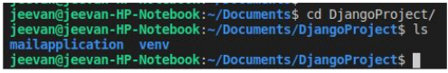
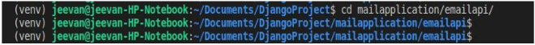
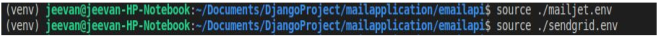
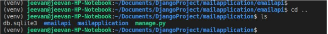
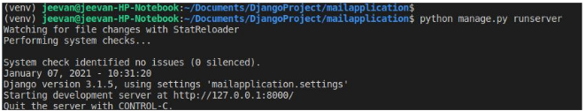
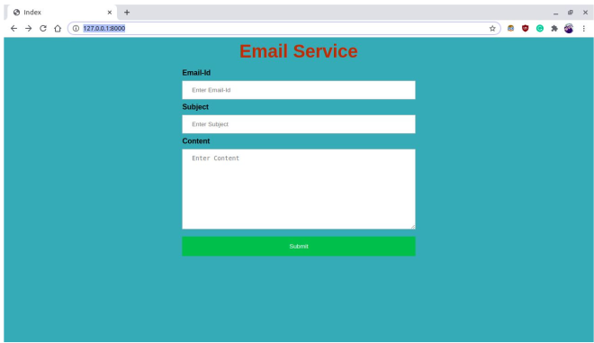
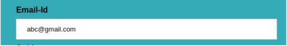
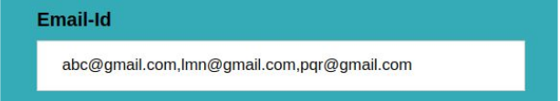
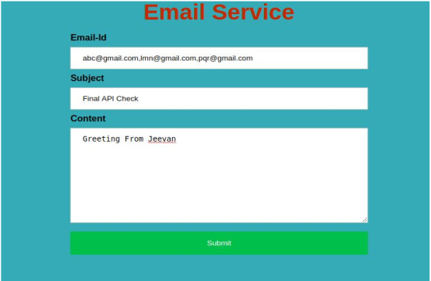
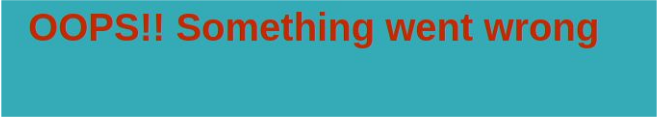

# EmailServiceDjangoAssignment-EmailService Documentation

EMail API Used in Project :

  1. SendGrid
  2. Mailjet

Step 1 - ​ Setting the Environment variable

    ● Change your working directory to DjangoProject
   
   
    ● Activate virtual environment (‘venv’)
      1. Type the following command to activate it.
      2. $source venv/bin/activate
   
      
      3. (venv) right before the root user indicate that the virtual environment is activated

Step 2 - ​ Setting the environment variable of Sendgrid, Mailjet

    ● Change the directory to “mailapplication/emailapi/”
   
   
    ● Type the below command to set the environment variable
      $ source ./sendgrid.env
      $ source ./mailjet.env
   

Step 3 - ​ Run the Django Server

    ● Change the directory to mailapplication “cd ..”
   
    
    ● Type the below command to run server
      $ python manage.py runserver
  
    
    ● Go to Browser run URL “​http://127.0.0.1:8000/​”

Step 4 - ​ User Input Format

    ● If there is only one email then
  
   
   
    ● If there are multiple emails then separate them by “,”(Comma)
  
   
    ● Enter all the Details “All details are required” & Submit.
  
    
    ● If the email successfully sends then you get this message.
  
    
    ● If an error occurred during the process then you get this message
  
